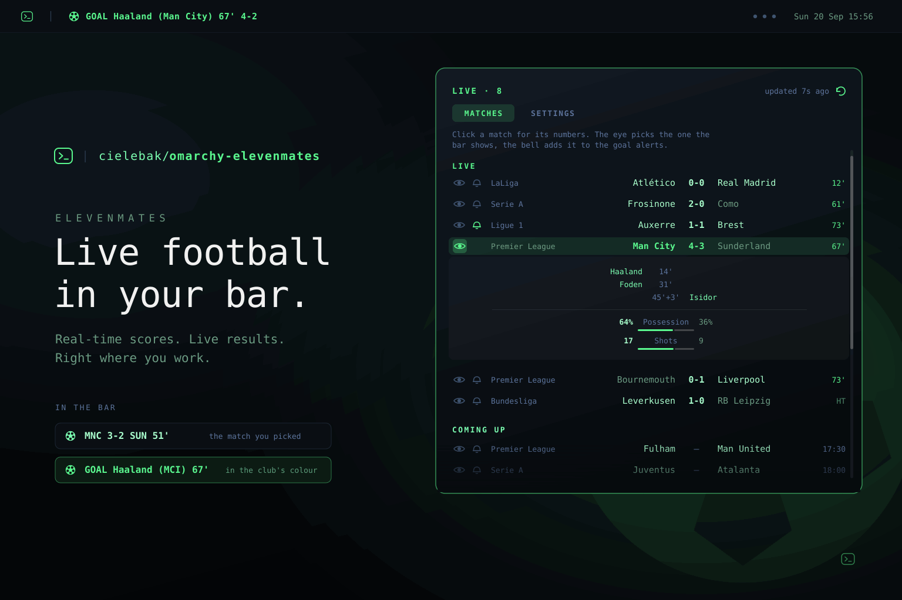

# Elevenmates



Live football scores in the [Omarchy](https://omarchy.org/) bar.

The bar carries one match: the one you picked, or - if you picked none - the
most interesting one it can find right now. Clicking the button opens today's
card: what is running, what kicks off later, what has just finished.

No account, no API key, nothing to configure before it works.

## Install

```bash
omarchy plugin add https://github.com/cielebak/omarchy-elevenmates.git --enable
```

Omarchy 4.0 or newer - that is the release whose shell loads third-party
plugins from `~/.config/omarchy/plugins/`. Beyond it, Python 3 and
`notify-send` are the only requirements, and Omarchy ships both. Nothing
outside the plugin's own directory is touched on install.

## Remove

```bash
omarchy plugin remove elevenmates
```

That takes the widget out of the bar and deletes
`~/.config/omarchy/plugins/elevenmates`. Two files are written outside it and
are left behind, so reinstalling finds your competitions and clubs as you left
them; delete them by hand if you want it gone completely:

```bash
rm -f ~/.config/omarchy/elevenmates.json          # your settings
rm -rf ~/.local/state/omarchy/elevenmates         # the score cache
```

## What the bar shows

```
⚽ MNC 3-2 SUN 51'                     a live match
⚽ MNC 3-2 SUN HT                      the same match on its tea break
⚽ FUL – MAN 17:30                     a fixture later today
⚽ GOAL  Haaland (Man City) 67'  4-2   for a few seconds after a goal
```

A goal pulses the widget in the scoring club's own colour, names the scorer,
and - unless switched off - raises a notification.

## The card

Every row carries two switches on the left:

- **The eye** picks the match the bar shows. Only one can be on, because the
  bar carries one match. Turn it off and the bar goes back to choosing - or,
  under `Picked match only`, carries nothing at all.
- **The bell** adds that match to the goal alerts. As many as you like. It is
  hidden on the row the eye is on: the match the bar carries is alerted on
  anyway, so a bell there would be a switch that changes nothing. Turn the eye
  off and the bell comes back as you left it.

Neither switch is drawn on a match that has already been played: there is
nothing left to follow and no goal left to announce. One that was already on
stays until you turn it off, so a row never carries a setting you cannot
clear.

Clicking the rest of the row opens the match: who scored and when, then
possession, shots, shots on target, corners, cards and fouls, each with a meter
so the shape of the match reads without reading a number. Those numbers cost
their own request, so they are only fetched for the match you have open.

## Settings

In the panel, under **SETTINGS**:

| Setting | What it does |
| --- | --- |
| Competitions | Which ones are fetched. One request each, so a shorter list refreshes faster and a longer one raises the floor under the live refresh interval. Pick none and the widget shows nothing at all. |
| Your clubs | Their matches sort first, the bar prefers them, and they get goal alerts without touching the bell. |
| What the bar shows | `Auto` falls back to any live match when none of your clubs are playing. `Favorites only` and `Any live match` are the strict readings. `Picked match only` does not fall back at all: with no eye on a row the bar carries nothing and shrinks to the ball. |
| Notify on goals | And whether that covers every match or only the ones you marked. |
| Refresh intervals | One for while a match is live, one for the rest of the day. The live one will not go below two seconds per competition followed. With nothing at all on today's card the idle one stretches itself, and stretches further between 01:00 and 07:00. |
| Test the goal alert | Fires the alert once off a real match, so the colours can be checked without waiting for someone to score. |

Settings live in `~/.config/omarchy/elevenmates.json`, not in the widget's
`shell.json` entry. `omarchy bar set` hands its value to the shell over an IPC
call that flattens a JSON array into separate arguments, so a list of
competitions comes back as a bare string - or is rejected outright. Keeping the
file separate also means picking a match does not rewrite `shell.json` and
reload the whole bar.

## Where the data comes from

Mostly ESPN's public endpoints - no account and no key. They are undocumented and
publish no rate limit, which is not the same as having none, so the widget
keeps its own: at most six requests in flight, one connection per worker reused
across the sweep, and a floor under the live refresh interval that rises with
the number of competitions followed.
`bin/elevenmates fetch` asks one scoreboard endpoint per competition in
parallel and folds the answers into
`~/.local/state/omarchy/elevenmates/state.json`, which the QML side watches. A
competition that fails to answer keeps its previous matches rather than
blanking the bar. Only today's fixtures are kept, plus anything still being
played.

Ekstraklasa is the one exception. ESPN publishes 219 soccer competitions and
not one of them is Polish, so `pol.1` is served by Sofascore's public endpoints
instead - also undocumented, also no key. It costs a little more per sweep: two
requests for the round, plus one for the scorers of any match whose score has
moved since the last one. A scoreline that has not moved cannot have grown a
goal, so in the steady state it is the two. Everything the second source
returns is folded into the same shape as the first, so a Polish row on the card
reads exactly like an English one.

## Competitions

44 on the picker. Any competition ESPN carries works even when it is not
listed - put its slug into `leagues` in the config file by hand and it is
fetched like the rest.

**England**

| Slug | Competition |
| --- | --- |
| `eng.1` | Premier League |
| `eng.2` | Championship |
| `eng.fa` | FA Cup |
| `eng.league_cup` | EFL Cup |

**Rest of Europe**

| Slug | Competition | Country |
| --- | --- | --- |
| `esp.1` | LaLiga | Spain |
| `esp.copa_del_rey` | Copa del Rey | Spain |
| `ger.1` | Bundesliga | Germany |
| `ger.2` | 2. Bundesliga | Germany |
| `ger.dfb_pokal` | DFB-Pokal | Germany |
| `ita.1` | Serie A | Italy |
| `ita.coppa_italia` | Coppa Italia | Italy |
| `fra.1` | Ligue 1 | France |
| `fra.coupe_de_france` | Coupe de France | France |
| `ned.1` | Eredivisie | Netherlands |
| `pol.1` | Ekstraklasa | Poland |
| `por.1` | Primeira Liga | Portugal |
| `sco.1` | Premiership | Scotland |
| `bel.1` | Pro League | Belgium |
| `tur.1` | Super Lig | Turkey |
| `gre.1` | Super League | Greece |
| `aut.1` | Bundesliga | Austria |
| `swe.1` | Allsvenskan | Sweden |
| `nor.1` | Eliteserien | Norway |
| `den.1` | Superliga | Denmark |

**Outside Europe**

| Slug | Competition | Country |
| --- | --- | --- |
| `usa.1` | MLS | United States |
| `mex.1` | Liga MX | Mexico |
| `bra.1` | Brasileirao | Brazil |
| `arg.1` | Liga Profesional | Argentina |
| `ksa.1` | Saudi Pro League | Saudi Arabia |

**European club competitions**

| Slug | Competition |
| --- | --- |
| `uefa.champions` | Champions League |
| `uefa.champions_qual` | Champions League qualifying |
| `uefa.europa` | Europa League |
| `uefa.europa_qual` | Europa League qualifying |
| `uefa.europa.conf` | Conference League |
| `uefa.europa.conf_qual` | Conference League qualifying |
| `uefa.super_cup` | UEFA Super Cup |
| `fifa.cwc` | Club World Cup |

**National teams**

| Slug | Competition |
| --- | --- |
| `fifa.world` | World Cup |
| `fifa.worldq.uefa` | World Cup qualifying, Europe |
| `uefa.euro` | European Championship |
| `uefa.euroq` | European Championship qualifying |
| `uefa.nations` | Nations League |
| `uefa.euro_u21` | Euro U21 |
| `fifa.friendly` | International friendlies |

Ten are picked out of the box: the five big leagues, the three European club
competitions, the Nations League and World Cup qualifying.

## Commands

```bash
bin/elevenmates fetch                 # refresh the cache now
bin/elevenmates config show           # every setting
bin/elevenmates config get leagues    # one setting
bin/elevenmates config set leagues '["eng.1","uefa.champions"]'
bin/elevenmates demo-goal             # fire the goal alert once
bin/elevenmates leagues               # competition picker options
bin/elevenmates teams                 # club picker options
```

`fetch` takes:

| Flag | What it does |
| --- | --- |
| `--force` | Sweep even if another widget just did. A refresh asked for by hand is never skipped; the widget's own timer does not pass this. |
| `--headline <event-id>` | The match the bar is carrying, so its goals count as watched even with no club followed and no bell set. |
| `--stats <league>:<event-id>` | Also fetch that one match's team numbers. The panel passes whichever card it has open. |
| `--out <path>` | Where the cache is written. Defaults to `~/.local/state/omarchy/elevenmates/state.json`. |

`demo-goal` takes `--out` and `--scorer <name>`; every command takes
`--config <path>`.

Over IPC:

```bash
omarchy-shell elevenmates refresh
omarchy-shell elevenmates open
omarchy-shell elevenmates close
omarchy-shell elevenmates toggle
omarchy-shell elevenmates settings
omarchy-shell elevenmates expand <league> <event-id>
```

Middle-clicking the bar widget also forces a refresh.

## Licence

MIT. Not affiliated with ESPN or Sofascore; it reads the same public endpoints
a browser does.
